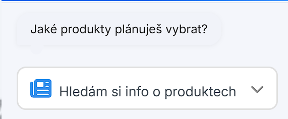
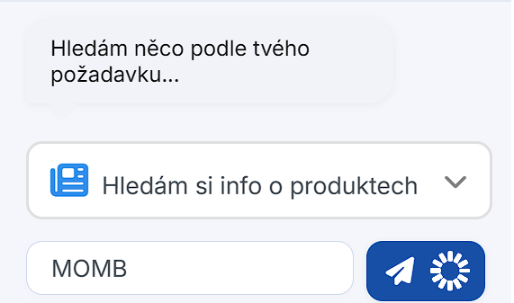
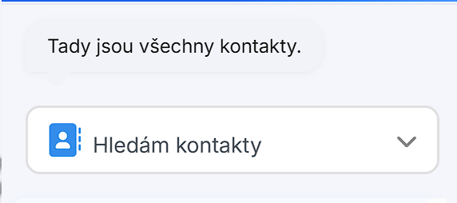
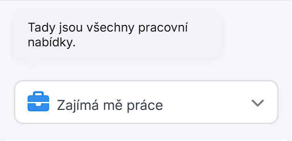
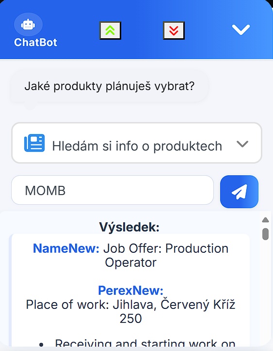
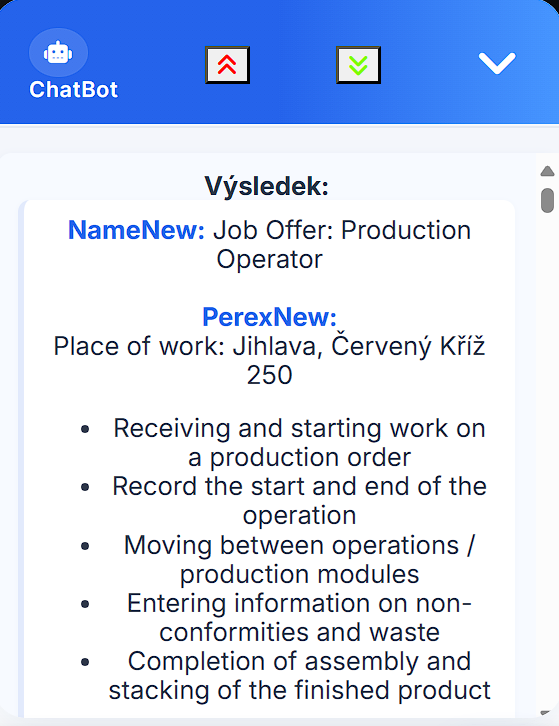
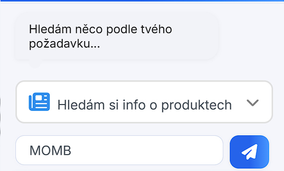
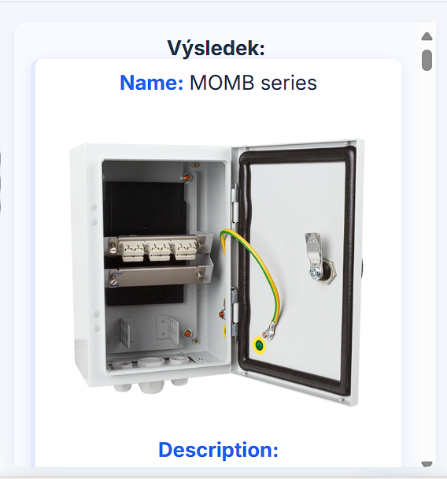
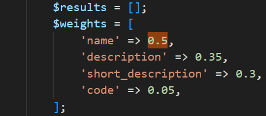

# 🤖 Chatbot s embeddings pro produkty, práci a kontakty

[](#)
[](#)
[](#)

Inteligentní chatbot, který načte data z DB, převede texty do vektorů (embedding) a na základě **similarity** vrací nejrelevantnější odpověď. Napojený na produktové tabulky, pracovní nabídky a kontakty. Běží jako skript spouštěný přes `bin/console` + **CRON**.

---

## 📚 Obsah
- [Princip](#-princip)
- [Funkce chatbota](#-funkce-chatbota)
- [Pipeline & aktualizace](#-pipeline--aktualizace)
- [Ukázky UI](#-ukázky-ui)
- [Vyhledávání produktů](#-vyhledávání-produktů)
- [Weights / váhy polí](#-weights--váhy-polí)
- [Demo video](#-demo-video)
- [Poznámky k nasazení](#-poznámky-k-nasazení)

---

## 🧠 Princip
- Z databáze se načtou tabulky, se kterými má chatbot pracovat.
- **Embedding**: veškerá textová data se skriptem převedou do vektorů a uloží do DB.
- Při každém dotazu se vygeneruje vektor dotazu **realtime** a porovná se s uloženými vektory.
- Podle nejvyšší **similarity** chatbot vybere odpověď a vrátí ji v poli `response`.

Skript je nyní v **Pythonu** (může být přepsán do JS). Výhoda: běží mimo prohlížeč, bez nutnosti tokenizeru v klientu.

---

## ✨ Funkce chatbota
- Napojení na **produkty**, **pracovní nabídky** a **kontakty** (návrhy se zobrazují najednou po výběru varianty).
- Chatbot:
  - pozdraví uživatele,
  - komentuje jeho akce,
  - umožní **zvětšit / zmenšit** zobrazovací okno.

---

## 🔁 Pipeline & aktualizace
- Spouštění: `bin/console` (napojené na **CRON**).
- Zbývá rozhodnout **frekvenci aktualizací** (doporučení níže):
  - Produkty: každých 6–12 h (dle obrátkovosti katalogu).
  - Pracovní nabídky: 1× denně.
  - Kontakty: týdně nebo při změně.

> Pokud se mění jen část záznamů, zvaž **inkrementální re-embedding** (reindex jen změněných položek).

---

## 🖼 Ukázky UI

**Komentáře a návrhy:**

<table>
<tr>
<td></td>
<td></td>
</tr>
<tr>
<td></td>
<td></td>
</tr>
</table>

**Zvětšení / zmenšení okna:**

<table>
<tr>
<td></td>
<td></td>
</tr>
<tr>
<td></td>
<td></td>
</tr>
</table>

---

## 🔎 Vyhledávání produktů
Vyhledávání běží nad **vektorovými poli** jednotlivých tabulek a dotazem od chatbota:

<p align="center">
  
</p>

<p align="center">
  
</p>

**Příklad:** dotaz → vektor → výběr top-N podobností → sestavení odpovědi.

---

## ⚖ Weights / váhy polí
Můžeš přidat „pocitové“ váhy (weighting) mezi poli, např. `name` (název produktu), `description` (popis) apod. — konečný **score** pak bude vážený součet podobností:

<p align="center">
  
</p>

> Tip: u krátkých názvů dej nižší váhu než u popisů, ale vyšší než u volných poznámek.

---

## 🎬 Demo video

> GitHub v README nepřehraje `.mp4`. Použij náhled (thumbnail) → klik → otevře video.

[](./2025-08-04-09-23-40_w6FGH3gB.mp4)

> Jak vytvořit náhled (volitelné):
> ```bash
> # vybere snímek z 3. sekundy
> ffmpeg -i 2025-08-04-09-23-40_w6FGH3gB.mp4 -ss 00:00:03 -vframes 1 ./prezentace/video_thumbnail.png
> ```

---

## 🚀 Poznámky k nasazení
- **CRON**: spouštěj re-embedding mimo špičku; loguj počet změn a délku běhu.
- **DB**: index nad vektorovým sloupcem (FAISS/pgvector/Annoy/HNSW dle DB) pro rychlé dotazy.
- **Bezpečnost**: ošetři vstupy v chatu, limituj délku dotazu a počty výsledků.
- **Monitoring**: metriky (čas dotazu, přesnost, pokrytí, chybovost) → grafy.